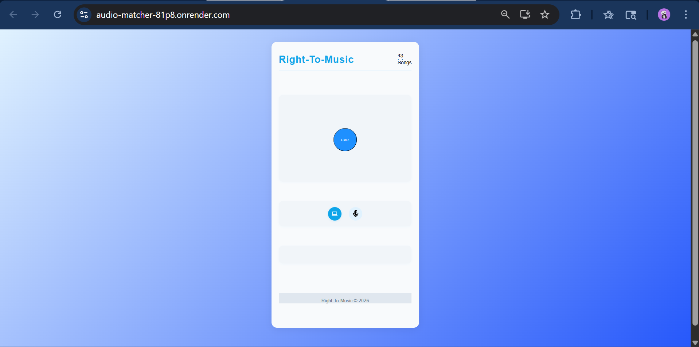

# RightToMusic

### A full-stack audio fingerprinting system for identifying songs from short snippets — built with a custom Shazam-like algorithm, Python backend, and React frontend.

_A modular pipeline combining spectrogram analysis, FFT-based fingerprinting, and a grid-searched parameter system to recognize songs from just 5 seconds of audio. By Shivam_

Identifying a song from a short clip is harder than it looks. Audio is noisy, snippets can start anywhere, and naive approaches fall apart quickly. **RightToMusic** tackles this by building a full audio fingerprinting pipeline from scratch — inspired by Shazam's algorithm — and wrapping it in a React frontend with real-time identification.

This project treats **acoustic fingerprints as a search problem**: extract a compact hash representation from any snippet, look it up against a database of known songs, and rank candidates by match strength. A full grid search was run to find the optimal fingerprinting parameters, achieving **73.33% Top-7 accuracy** on held-out 5-second snippets.

### Goal of the Project

The goal was to build a **reproducible, end-to-end music identification system** that:
1. Ingests full-length songs and stores their fingerprints in a database
2. Accepts a short audio snippet (live or file-based) as a query
3. Matches it against the database using spectrogram-based fingerprinting
4. Returns a **ranked list of candidate songs** with the correct match in the top results

A grid search over fingerprinting hyperparameters was conducted to maximize identification accuracy.

### What I Did

- I implemented a **custom audio fingerprinting pipeline** inspired by the Shazam algorithm, fully re-written in Python from an open-source Go reference:

  - **Spectrogram Generation** ([`spectrogram.py`](Project/server/shazam/spectrogram.py)): Converts raw audio into a time-frequency representation using FFT, forming the basis for fingerprint extraction.
  - **Fingerprint Generation** ([`fingerprint.py`](Project/server/shazam/fingerprint.py)): Extracts robust, compact hashes from spectrogram peaks. Stores fingerprints in a SQLite database for fast candidate lookup.
  - **Matching & Ranking** ([`sqlite.py`](Project/server/db/sqlite.py)): Queries the fingerprint database and ranks candidate songs by match density.

- A **grid search** was run over key fingerprinting parameters to maximize Top-K accuracy on held-out 5-second snippets:

  | Parameter | Best Value | Description |
  |---|---|---|
  | `coef1` | 0.25 | Peak detection coefficient 1 |
  | `coef2` | 0.5 | Peak detection coefficient 2 |
  | `targetZoneSize1` | 8 | Pairing zone size (dimension 1) |
  | `targetZoneSize2` | 2 | Pairing zone size (dimension 2) |
  | `threshold` | 7 | Minimum peak magnitude threshold |
  | `tolerance` | 100 | Time offset tolerance for matching |

- A **Flask backend** exposes REST endpoints for song ingestion, fingerprint lookup, Spotify download integration, and database management, plus a CLI interface for direct use.

- A **React frontend** provides real-time song identification via microphone capture, with WebAssembly support for in-browser audio processing.

### Architecture

```
┌─────────────────────┐    ┌─────────────────────┐    ┌─────────────────────┐
│   React Frontend    │    │   Flask Backend     │    │  Fingerprint Engine │
│                     │    │                     │    │                     │
│ • Live Mic Capture  │◄──►│ • REST API          │◄──►│ • spectrogram.py    │
│ • Song ID Results   │    │ • CLI Interface     │    │ • fingerprint.py    │
│ • Match Rankings    │    │ • Spotify DL        │    │ • SQLite DB         │
│ • WebAssembly Audio │    │ • DB Management     │    │ • Rank & Match      │
└─────────────────────┘    └─────────────────────┘    └─────────────────────┘
          │                          │                          │
          └──────────────────────────┼──────────────────────────┘
                                     │
                    ┌────────────────▼────────────────┐
                    │         Data Pipeline           │
                    │                                 │
                    │ • Audio ingest   (FFmpeg)       │
                    │ • Spectrogram    (FFT)          │
                    │ • Peak picking   (threshold)    │
                    │ • Hash pairs     (fingerprint)  │
                    │ • DB lookup      (SQLite)       │
                    │ • Rank output    (Top-K)        │
                    └─────────────────────────────────┘
```

### Dataset

The project includes a test dataset of:
- **10 original full-length songs** used for fingerprint database construction
- **5-second snippets** of each song sampled at multiple time offsets (snippet1, snippet2, snippet4)
- **Labeled CSV mapping files** for ground-truth evaluation
- Both small and large test sets for comprehensive algorithm benchmarking

### Grid Search Results

All parameter sets were evaluated on held-out 5-second snippets. Below are the results from the best-performing configuration.

#### Best Parameter Set

```
{'coef1': 0.25, 'coef2': 0.5, 'targetZoneSize1': 8, 'targetZoneSize2': 2, 'threshold': 7, 'tolerance': 100}
```

#### Top-5 Accuracy — 53.33%

| Song | Snippet | Correct Label | Rank Found |
|---|---|---|---|
| song1 | snippet2 | Banjaara | 1 |
| song2 | snippet1 | M Bole To | 1 |
| song4 | snippet2 | Suit Suit | 1 |
| song4 | snippet4 | Suit Suit | 1 |
| song6 | snippet1 | Hawa Hawai | 1 |
| song6 | snippet2 | Hawa Hawai | 1 |
| song3 | snippet1 | Hanuman Chalisa | 3 |
| song3 | snippet4 | Hanuman Chalisa | 3 |
| song10 | snippet4 | Dua (Article 370) | 4 |
| song2 | snippet4 | M Bole To | 4 |
| ... | ... | ... | ... |
| song5, 7, 8, 9 | all | various | not in top-5 |

#### Top-7 Accuracy — 73.33% ✦ Best Result

Extending to Top-7 candidates recovers several additional correct matches — notably `Falak Tak` (rank 7), `M Bole To` (rank 7), and `DJ Waley Babu` (rank 6 across all three snippets of song9).

| Metric | Value |
|---|---|
| Top-5 Accuracy | 53.33% |
| **Top-7 Accuracy** | **73.33%** |

Songs that consistently failed identification (`Bekhayali`, `I Love You`, `Falak Tak`) suggest that certain tracks are underrepresented in the fingerprint database or are acoustically similar to higher-frequency songs like `Suit Suit` and `Hawa Hawai`, which dominate false-positive predictions.

---

### Use

#### Prerequisites

**Backend:** Python 3.6+, FFmpeg, pip  
**Frontend:** Node.js 14+, npm, modern browser with WebAssembly support

#### Installation

```bash
git clone https://github.com/shivamk1075/Right-To-Music
cd Right-To-Music
```

Install backend dependencies:

```bash
cd Project/server
pip install -r requirements.txt
```

Install frontend dependencies:

```bash
cd ../client
npm install
```

#### Running the App

Start the backend:

```bash
cd Project/server
python main.py serve --proto http -p 5000
```

Start the frontend:

```bash
cd Project/client
npm start
```

The app will be available at `http://localhost:3000`.

#### CLI Commands

```bash
# Identify a song from a file
python main.py find <file_path>

# Download a song from Spotify
python main.py download <spotify_url>

# Erase all songs from the database
python main.py erase

# Erase a specific song by ID
python main.py eraseID <SongID>
```

### Live Demo

A live deployment of the app is hosted on Render and accessible here:

**🔗 [https://audio-matcher-81p8.onrender.com](https://audio-matcher-81p8.onrender.com)**

> **Note:** The app is hosted on a free Render instance — it may take 30–60 seconds to wake up on first load.

### Example

__


### References & Inspiration

- **Original Go Implementation** by Chigozirim Igweamaka (MIT Licensed): The conceptual foundation for the fingerprinting approach. This codebase is a full re-implementation in Python.
- **Shazam's Audio Fingerprinting** — Wang, A. (2003). _An Industrial-Strength Audio Search Algorithm_: The algorithmic basis for constellation map fingerprinting and time-pair hashing.

### Thanks

- ... to **Chigozirim Igweamaka** for the open-source Go reference that inspired this project.
- ... to the **FFmpeg** and **librosa** communities for making audio processing in Python accessible.
- ... to the open-source community behind `Flask`, `SQLite`, and `React` for the full-stack scaffolding.

---

_For questions or suggestions, feel free to open an issue or reach out at shivam.kumar.101075@gmail.com_
